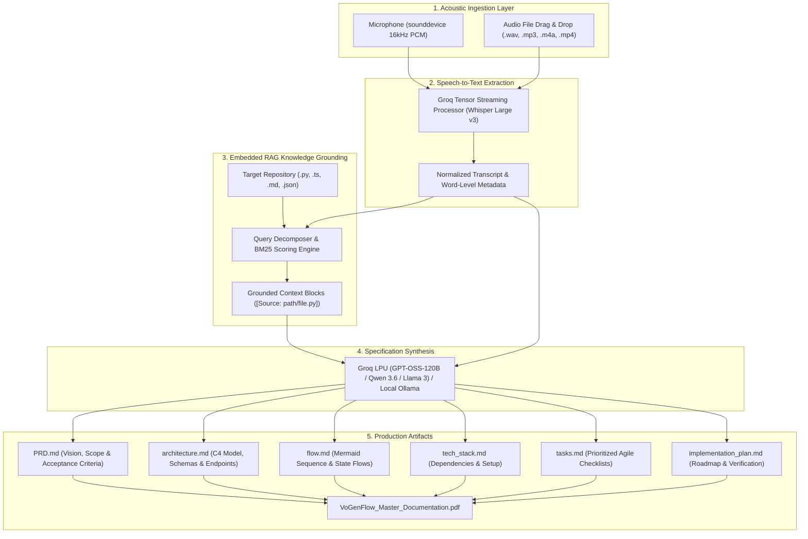

# ⚡ VoGenFlow: Voice-based Generative AI for Workflows

> **Transform unstructured spoken brainstorming, meeting recordings, and voice memos into production-grade engineering specifications, PRDs, C4 Mermaid architecture diagrams, execution flows, and actionable task checklists — grounded against your local codebase using embedded RAG.**

[](https://www.python.org/downloads/)
[](https://pypi.org/project/PyQt6/)
[](https://groq.com/)
[](https://groq.com/)
[](docs/Decisions.md)
[](https://opensource.org/licenses/MIT)

---

## 🌟 Executive Summary

Engineers, architects, and technical founders frequently conceptualize complex systems through spontaneous voice brain-dumps or design debates. However, converting these unstructured ideas into formal engineering specifications (`PRD.md`, `architecture.md`, `flow.md`, `tech_stack.md`, `tasks.md`, `implementation_plan.md`) is a high-friction, manual process.

**VoGenFlow (Voice-based Generative AI for Workflows)** bridges this gap:
1. **Live Microphone & File Ingestion**: Ingests audio via low-latency 16 kHz stream recording or drag-and-drop file upload (`.wav`, `.mp3`, `.m4a`, `.ogg`, `.flac`, `.mp4`).
2. **Sub-Second Speech-to-Text**: Powered by **Groq Whisper LPUs** (`whisper-large-v3-turbo`) for near-instant transcription with zero client GPU/VRAM overhead.
3. **Local Codebase RAG Grounding**: Employs an embedded **Okapi BM25** search index and **Spoken Query Decomposition** to ground prompts in your existing repository schemas, API models, and architectural standards.
4. **Engineering Blueprint Synthesizer**: Produces 6 standardized, publication-ready markdown artifacts with strict Mermaid diagrams and Agile checklist formatting (`- [ ]`).
5. **Modern PyQt6 Desktop UI**: A sleek, dark-themed interface with live audio waveform meters, non-blocking `QThread` workers, side-by-side transcript editor, and one-click repo export.
6. **Master PDF Documentation Compiler**: Automatically compiles all architectural case studies and project documents into a publication-ready master PDF report.

---

## 🏗️ System Architecture & Visual Pipeline

```
+-----------------------------------------------------------------------------------------------+
| ⚡ VoGenFlow: Voice-based Generative AI for Workflows   [Engine: Groq Cloud v] [🔑 Set API Key]|
+-----------------------------------------------------------------------------------------------+
| [1. Audio Input]            | [2. Transcript & RAG]           | [3. Generated Blueprints]     |
|                             |                                 |                               |
| [ |||||||||||||||||||||| ]  | Recognized Speech:              | [🚀 Generate All] [📄 Active]  |
| 00:14.2                     | "Build an AI legal analytics app| +---------------------------+ |
| [🎙️ Record] [⏸️ Pause]      | with FastAPI and Next.js..."    | | PRD | Arch | Flow | Tasks | |
|                             |                                 | +---------------------------+ |
| [ Drop Audio File Here ]    | Words: 643 | Latency: 7.64s     | # Project Requirements Doc    |
| [📂 Browse File...]         |                                 | ## 1. Executive Summary...    |
|                             | [x] Enable Local RAG            |                               |
| STT Model: [whisper-v3-t v] | [📁 Index Codebase] 12 chunks   |                               |
| [⚡ Transcribe Audio]       |                                 | [💾 Export Repo] [📑 PDF]     |
+-----------------------------------------------------------------------------------------------+
| Ready.                                                             [======== Progress Bar ==] |
+-----------------------------------------------------------------------------------------------+
```



---

## 📂 Codebase & Module Structure

```
vogenflow/
├── src/
│   ├── config.py                 # Centralized configuration & environment loader
│   ├── audio_recorder.py         # Thread-safe 16kHz audio capture with RMS visualizer callbacks
│   ├── stt_service.py            # Groq Whisper LPU client with multi-provider abstraction
│   ├── rag_engine.py             # Local BM25 inverted index with query decomposition & grounding
│   ├── insight_engine.py         # Specialized prompt synthesizer for PRD, Arch, Flow & Tasks
│   ├── export_service.py         # Repository & directory export manager
│   └── ui/
│       ├── audio_visualizer.py   # Custom PyQt6 dynamic multi-bar animated waveform widget
│       └── main_window.py        # 3-Pane responsive dark-themed PyQt6 desktop application
├── docs/
│   ├── Decisions.md              # File-by-file technical decisions & trade-off rationale
│   ├── Flow.md                   # Execution sequences, call hierarchies & Mermaid sequence flows
│   ├── Architecture.md           # C4 container models, data contracts & concurrency state machines
│   ├── PRD.md                    # Executive vision, personas & prioritized requirements (P0/P1/P2)
│   ├── tech_stack.md             # Stack matrix, dependency breakdown & hardware specifications
│   ├── design.md                 # UI/UX design tokens, visualizer mathematics & 3-pane layout
│   ├── rules.md                  # Engineering conventions, signal processing & prompt standards
│   ├── Test_Checklists_and_Rollback.md # QA test checklists, edge cases & disaster recovery plans
│   ├── comparison.md             # Wispr Flow comparative analysis, Voice 3.0 paradigm & monetization
│   └── generate_pdf_documentation.py   # ReportLab compiler generating the unified master PDF
├── tests/
│   ├── test_stt.py               # Unit tests for STT result models & format validation
│   ├── test_recorder.py          # Unit tests for buffer management & RMS calculation
│   └── test_rag.py               # Unit tests for BM25 ranking & query decomposition
├── output/
│   └── VoGenFlow_Master_Documentation.pdf # Master compiled PDF documentation
├── main.py                       # Dual-mode launcher (auto-detects GUI vs CLI mode)
├── requirements.txt              # Production dependency matrix
├── README.md                     # Comprehensive project documentation
└── .env.example                  # Environment configuration template
```

---

## 📚 Technical Case Study Suite (`docs/`)

The repository includes exhaustive documentation covering every aspect of the system:

| Document | Purpose |
| :--- | :--- |
| [**Decisions.md**](docs/Decisions.md) | File-by-file account of all implementation choices, trade-offs, and rationale. |
| [**Flow.md**](docs/Flow.md) | Entry points, sequence diagrams, execution order, and call hierarchies. |
| [**Architecture.md**](docs/Architecture.md) | C4 Container models, data contracts, threading paradigms, and security boundaries. |
| [**PRD.md**](docs/PRD.md) | Executive vision, user personas, and prioritized functional requirements (P0/P1/P2). |
| [**tech_stack.md**](docs/tech_stack.md) | Comprehensive technology stack matrix, dependencies, and hardware constraints. |
| [**design.md**](docs/design.md) | Dark-theme UI/UX design tokens, visualizer mathematics, and component layout. |
| [**rules.md**](docs/rules.md) | Engineering standards, signal processing rules, and prompt constraints. |
| [**Test_Checklists_and_Rollback.md**](docs/Test_Checklists_and_Rollback.md) | QA test matrices, edge-case coverage, and disaster recovery procedures. |
| [**comparison.md**](docs/comparison.md) | Wispr Flow comparative analysis, Voice 3.0 paradigm shift, and commercialization roadmap. |

---

## 🚀 Quick Start Guide

### 1. Installation

```bash
# 1. Clone repository
git clone https://github.com/your-username/VoGenFlow.git
cd VoGenFlow

# 2. Install dependencies
pip install -r requirements.txt
```

### 2. Configure API Key
Set your free Groq API key in `.env` (or configure it dynamically via the desktop GUI):
```bash
cp .env.example .env
# Edit .env and set: GROQ_API_KEY=gsk_...
```
*(Obtain a free key with 2,000 requests/day at [console.groq.com](https://console.groq.com/keys))*

### 3. Launch Graphical Desktop App

```bash
python main.py
```

### 4. CLI Headless Mode

```bash
# Record 10 seconds of speech
python main.py record --duration 10 --output temp_audio/my_note.wav

# Transcribe audio file
python main.py transcribe temp_audio/my_note.wav

# Generate blueprints grounded with local codebase RAG
python main.py generate --text "Build a high-performance legal AI system" --rag-dir ./my-repo --export-dir ./output
```

---

## 🧪 Verification & Unit Tests

Run the test suite:
```bash
python -m unittest discover tests
```

Recompile the Master PDF documentation:
```bash
python docs/generate_pdf_documentation.py
# Output saved to: output/VoGenFlow_Master_Documentation.pdf
```

---

## 📄 License
Distributed under the **MIT License**.
