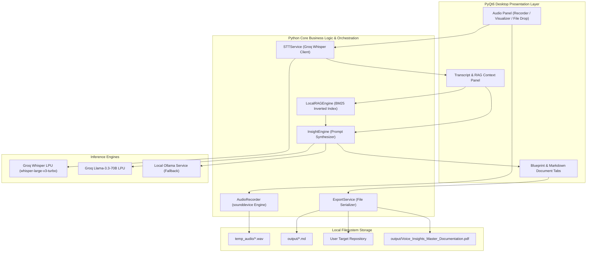
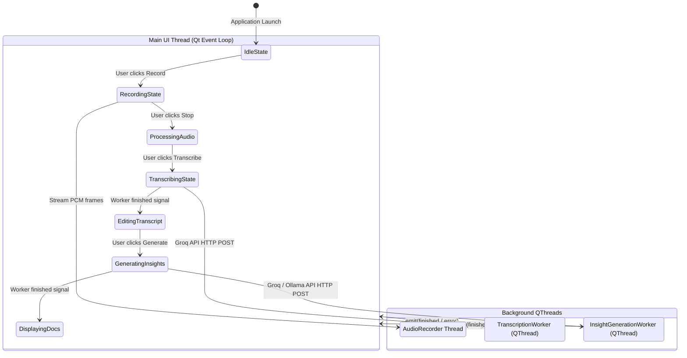

# System Architecture Specification (Architecture.md)

This document describes the high-level and component architecture of the **Voice-to-Insight System**, its layer boundaries, data models, concurrency paradigms, and security boundaries.

---

## 1. High-Level Architecture (C4 Container View)



---

## 2. Component Breakdown & Responsibilities

| Component | Primary Class | Key Responsibility | Threading Model |
| :--- | :--- | :--- | :--- |
| **Audio Recorder** | `AudioRecorder` | Captures microphone input, buffers frames, calculates RMS amplitude. | Native OS Audio Callback + Mutex Lock |
| **Visualizer** | `AudioVisualizer` | Renders dynamic multi-bar animated waveform UI with frequency jitter. | Qt Main UI Thread (30ms QTimer) |
| **STT Engine** | `STTService` / `GroqWhisperProvider` | Transcribes audio files into structured `STTResult` via Groq Whisper. | `TranscriptionWorker` (`QThread`) |
| **RAG Knowledge Base** | `LocalRAGEngine` | Scans local codebase, parses chunks, indexes inverted tokens, computes Okapi BM25 scores, decomposes voice queries. | Synchronous / Background task |
| **Insight Synthesizer** | `InsightEngine` | Orchestrates specialized system prompts to generate PRDs, Architecture docs, Flow diagrams, and Task lists. | `InsightGenerationWorker` (`QThread`) |
| **Export Service** | `ExportService` | Serializes generated markdown files directly into target project folders. | Synchronous File I/O |

---

## 3. Concurrency & Threading Architecture

To guarantee a responsive 60 FPS user interface without freeze-ups during network calls or large file reads, the system uses a clean multi-threaded architecture:



---

## 4. Data Models & Interface Contracts

### `STTResult` Data Model
```python
class STTResult:
    text: str                     # Clean transcribed text
    duration_seconds: float       # Total duration of source audio
    latency_seconds: float        # Time taken by Groq LPU to transcribe
    language: str                 # Detected ISO language code (e.g. "en")
    segments: list                # Timestamped word/phrase segments
    provider: str                 # "groq" or "local"
    model: str                    # "whisper-large-v3-turbo"
```

### `DocumentChunk` Data Model (RAG)
```python
class DocumentChunk:
    source_path: str              # Absolute or relative path to source file
    chunk_id: int                 # Sequence index within the file
    content: str                  # Raw text or code chunk
    title: str                    # File basename or section header
    tokens: list[str]             # Normalized token array for BM25 matching
```

---

## 5. Security & Privacy Architecture

1. **Zero Hardcoded Secrets**: All API keys are loaded via `.env` or input dynamically through a masked Qt dialog (`QLineEdit.EchoMode.Password`) in memory.
2. **Local Processing of Audio Buffers**: Live recording buffers are stored in a private local directory (`temp_audio/`) and never uploaded to any intermediary third-party servers other than the designated Groq endpoint.
3. **Offline Privacy Option**: Users working with confidential codebases can switch the provider to **Ollama**, ensuring zero telemetry or data leaves their local workstation.
