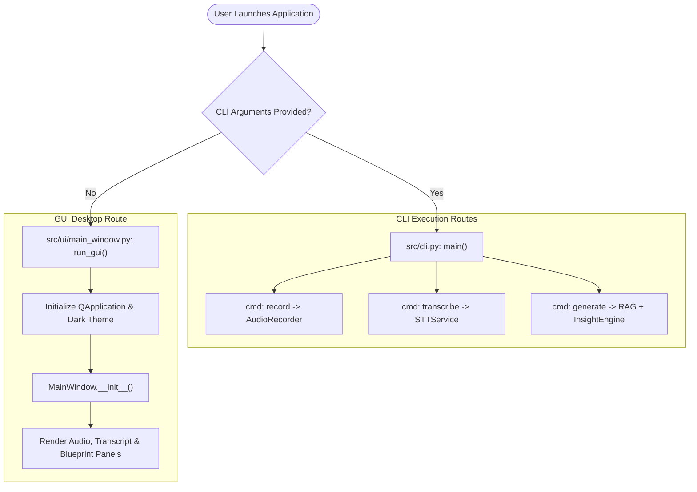
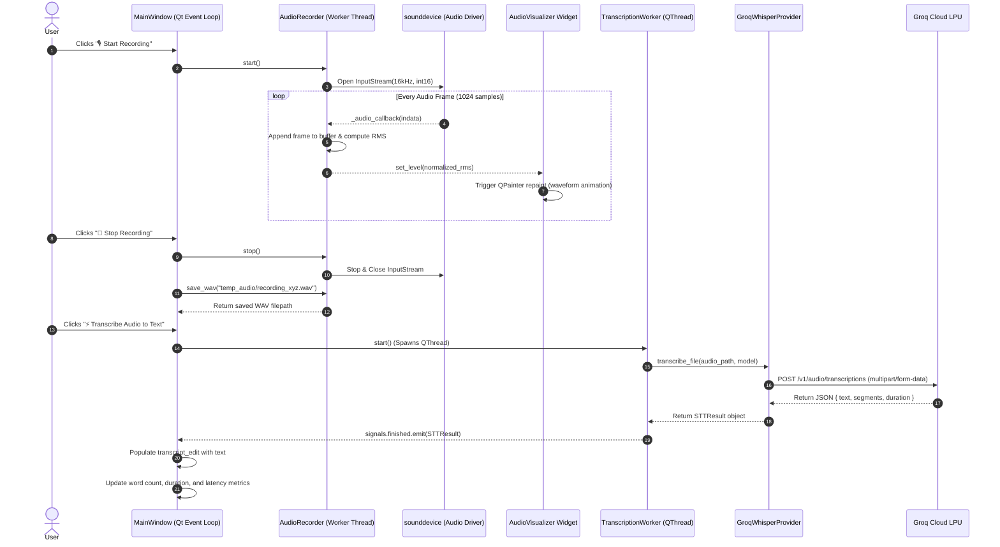
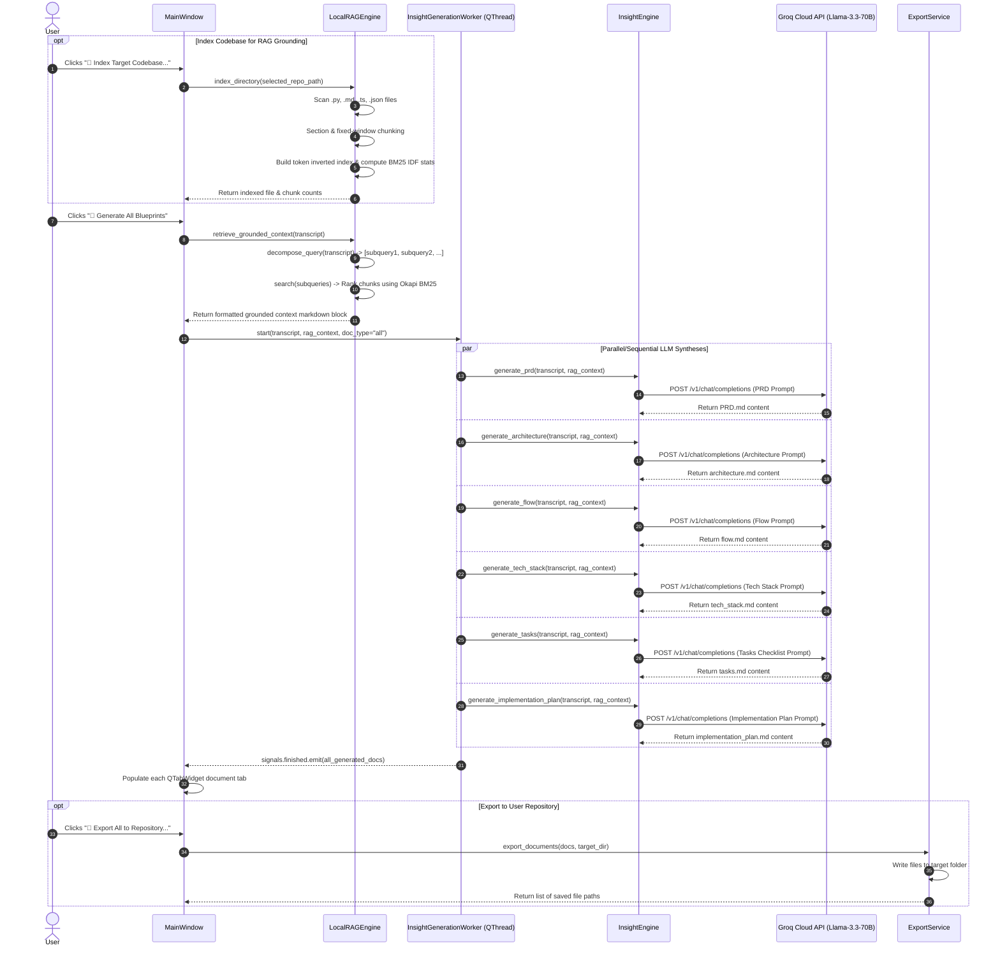

# System Execution Flow & Code Lifecycle (Flow.md)

This document maps every feature, entry point, execution order, function call hierarchy, and data transformation pipeline across the **Voice-to-Insight** system.

---

## 1. System Entry Points

---

## 2. End-to-End Execution Sequence

### Workflow A: Live Speech Recording & Transcription Flow

---

### Workflow B: RAG Context Retrieval & Insight Generation Flow

---

## 3. Function Call Hierarchy Matrix

| User Trigger | Initiating Function | Called Methods & Hierarchy | Destination Artifact / State |
| :--- | :--- | :--- | :--- |
| **Click "Start Recording"** | `_toggle_recording()` | `AudioRecorder.start()` $\to$ `sd.InputStream.start()` | Streaming microphone PCM buffer |
| **Audio Chunk Arrives** | `sd` driver | `_audio_callback()` $\to$ `AudioVisualizer.set_level()` $\to$ `QPainter.paintEvent()` | Real-time animated waveform UI |
| **Click "Stop Recording"** | `_toggle_recording()` | `AudioRecorder.stop()` $\to$ `AudioRecorder.save_wav()` | `temp_audio/recording_*.wav` |
| **Drop Audio File** | `DropZoneWidget.dropEvent()` | `MainWindow._on_file_selected()` | `current_audio_file` state updated |
| **Click "Transcribe"** | `_run_transcription()` | `TranscriptionWorker.start()` $\to$ `STTService.transcribe_file()` $\to$ `Groq.audio.transcriptions.create()` | Populates `transcript_edit` with cleaned text |
| **Click "Index Codebase"** | `_index_codebase_dir()` | `LocalRAGEngine.index_directory()` $\to$ `index_file()` $\to$ `_recompute_bm25_stats()` | In-memory BM25 index of project |
| **Click "Generate All"** | `_run_generation("all")` | `LocalRAGEngine.retrieve_grounded_context()` $\to$ `InsightGenerationWorker.start()` $\to$ `InsightEngine.generate_all()` | Populates all 6 tabs (`PRD`, `Arch`, `Flow`, `Tech`, `Tasks`, `Plan`) |
| **Click "Export to Repo"** | `_export_to_directory()` | `ExportService.export_documents()` | Writes `.md` files to user's Git directory |
| **Click "Export PDF"** | `_generate_pdf_report()` | `generate_master_pdf()` (ReportLab) | `Voice_Insights_Master_Documentation.pdf` |
