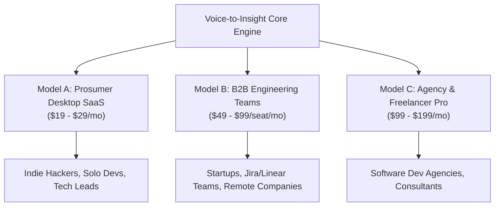

# Market Comparison, Positioning & Commercialization Strategy (comparison.md)

This document provides a technical comparison between **Voice-to-Insight** and modern voice dictation tools (such as **Wispr Flow** and **Superwhisper**), detailing the paradigm shift from basic dictation to autonomous blueprint synthesis, proprietary intellectual property moats, and a commercialization roadmap.

---

## 1. The 3 Generations of Voice Interfaces

```
Gen 1: Raw Transcription (Basic Whisper / Apple Dictation / Otter.ai)
   ↳ Voice ──▶ Verbatim Raw Text (Messy, filled with "umms", stutters, repetitions)

Gen 2: Smart Dictation (Wispr Flow / Superwhisper)
   ↳ Voice ──▶ Cleaned Text & Formatted Paragraphs (Pasted into active cursor)
   ↳ Focus: Saves typing keystrokes for general writing, messaging, and emails.

Gen 3: Cognitive Action & Architectural Synthesis (Voice-to-Insight)
   ↳ Voice ──▶ Decompose Intent ──▶ RAG Codebase Grounding ──▶ 6-Doc Engineering Blueprint Suite + Mermaid Diagrams + PDF
   ↳ Focus: Saves hours of engineering planning, PRD authoring, and system architecture design.
```

---

## 2. Feature-by-Feature Comparison: Voice-to-Insight vs. Wispr Flow

| Dimension | **Wispr Flow (Gen 2: Smart Dictation)** | **Voice-to-Insight (Gen 3: Cognitive Synthesis)** |
| :--- | :--- | :--- |
| **Primary Utility** | Faster typing in chat boxes, emails, and notes. | Autonomous software architecture, PRD authoring, and task automation. |
| **Output Format** | Single text block / auto-formatted paragraph inserted at cursor. | **6 Standardized Engineering Artifacts** (`PRD.md`, `architecture.md`, `flow.md`, `tasks.md`, `tech_stack.md`, `implementation_plan.md`) + **Master PDF**. |
| **Codebase Awareness** | **None.** Operates in a vacuum without knowledge of real schemas or code. | **Deep Codebase Grounding (RAG).** Scans `.py`, `.ts`, `.md`, `.json` repositories using Okapi BM25 to prevent hallucinations. |
| **Visual Architecture** | None (text-only). | **Generates parseable Mermaid diagrams** (System flowcharts, sequence diagrams, state machines). |
| **Latency & Hardware** | Cloud WebSockets to Whisper (~1–2s). | **Groq LPU Acceleration**: Sub-second transcription (200–400ms) with zero client GPU overhead. |
| **Execution Flexibility** | Cloud-only proprietary SaaS. | **Dual Engine**: High-speed Groq Cloud + **100% Offline/Private Ollama Local Fallback**. |
| **Target User Base** | General office workers, writers, and casual communicators. | Software engineers, system architects, technical founders, and dev agencies. |

---

## 3. How the Pipeline Operates Under the Hood


### The Cognitive Difference: A Real-World Example
Suppose an engineer speaks for 30 seconds:
> *"Hey, let's add an audio caching layer to our STT pipeline so if the same user uploads a file twice we don't hit the Groq API again. Store the hash in Redis or SQLite and add a task to write unit tests for it."*

* **In Wispr Flow**:
  > Cleans the grammar and types:  
  > *"Let's add an audio caching layer to our STT pipeline to avoid re-querying the Groq API for duplicate files, using Redis or SQLite for hash storage, along with unit tests."*  
  > *(The user still has to manually design the architecture, write the PRD, create the task list, and draw sequence diagrams).*

* **In Voice-to-Insight**:
  > 1. Searches the local repository to see how files, buffers, and hashes are handled.  
  > 2. Generates **`PRD.md`** with problem statements, functional requirements, and cache invalidation policies.  
  > 3. Generates **`architecture.md`** with a Mermaid diagram:  
  >    `Audio Ingestion ──▶ SHA-256 Hash ──▶ Cache Lookup ──▶ [Hit: Instant Return] / [Miss: Groq LPU]`.  
  > 4. Generates **`tasks.md`** with a prioritized checklist:
  >    - [ ] `Phase 1: Implement SHA-256 audio buffer hashing in audio_recorder.py`
  >    - [ ] `Phase 2: Add SQLite/Redis cache lookups in stt_service.py`
  >    - [ ] `Phase 3: Write cache hit/miss unit tests in tests/test_stt.py`  
  > 5. Exports all files directly to the repository and compiles the **Master PDF**.

---

## 4. Commercialization & Business Models



### Model A: Prosumer Desktop SaaS ("Cursor for Voice Architecture")
* **Target Audience**: Solo developers, architects, indie hackers, and technical founders.
* **Pricing Tier**: **$19 – $29 / month**.
* **Key Features**:
  - Global hotkey shortcut on Windows/macOS.
  - Automatic codebase RAG indexing.
  - 1-Click export to local Git repos and Markdown files.

### Model B: B2B Engineering & Sprint Planning Suite
* **Target Audience**: Startups and enterprise engineering teams using Jira, Linear, GitHub, and Notion.
* **Pricing Tier**: **$49 – $99 / seat / month**.
* **Key Features**:
  - Ingests Zoom/Google Meet architecture discussions.
  - Automatically extracts architectural decisions and **creates Jira/Linear epics and GitHub issues**.
  - Team-wide synchronized codebase schemas and architecture standards.

### Model C: Software Agency & Client Discovery Accelerator
* **Target Audience**: Digital product agencies, dev shops, and freelance technical consultants.
* **Pricing Tier**: **$99 – $199 / month**.
* **Key Features**:
  - Ingests 30-minute client discovery calls.
  - Generates instant branded PDF project proposals, technical architecture specifications, and task/cost breakdowns in 30 seconds.

---

## 5. Proprietary Intellectual Property Moats

To establish defensibility against generic AI wrappers:

1. **Proprietary Multi-Agent Planning Pipelines**:
   - Algorithmic translation of non-linear spoken disfluencies into validated, syntax-checked Mermaid diagrams, schema contracts, and Agile tasks.
2. **Deep Code Graph RAG**:
   - Hybrid indexing combining Abstract Syntax Tree (AST) code structures, dependency graphs, and Okapi BM25 semantic retrieval.
3. **IDE-Native Plugins (VS Code, JetBrains, Cursor)**:
   - Voice-activated architecture assistant embedded directly inside the developer's active workspace.
4. **Enterprise Air-Gapped Privacy Mode**:
   - Zero-data-retention on-premise execution using local Ollama models for high-security fintech, healthcare, and defense clients.

---

## 6. Financial Unit Economics & Profit Margins

Using Groq LPU infrastructure yields extraordinary profit margins:

| Expense Layer | Estimated Cost | User Subscription | Gross Margin |
| :--- | :--- | :--- | :--- |
| **STT (Groq Whisper)** | ~$0.04 / hour of audio | — | — |
| **LLM (Groq Llama-3.3-70B)** | ~$0.005 / full blueprint suite | — | — |
| **Total Monthly Cost Per Active User** | **~$0.40 – $0.80 / month** | **$20.00 / month** | **> 96% Gross Margin** |

The negligible API cost structure allows offering a generous free tier for viral adoption while capturing high-margin subscription revenue on paid tiers.
